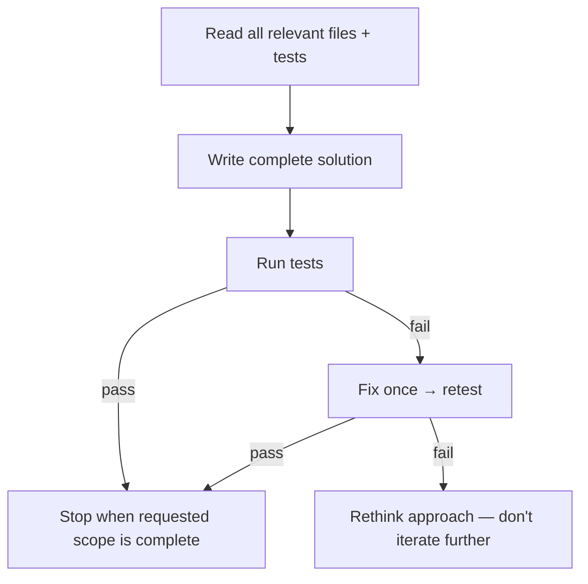
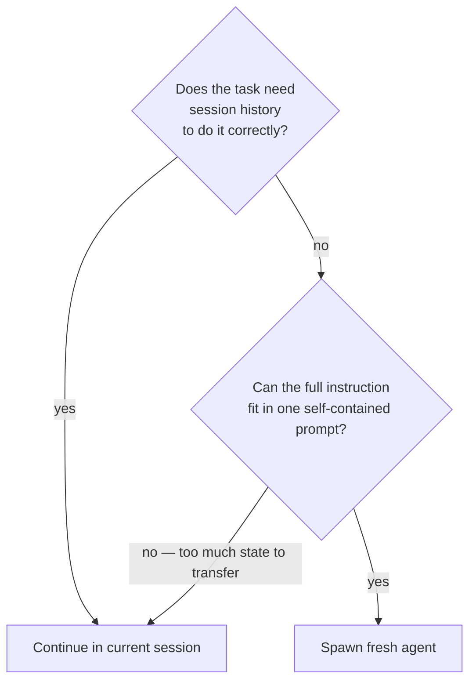

# Tokenomy

Goal: spend the fewest tokens that still produce correct, complete work. These are defaults
— skip any rule when it would cost correctness or the user asked for full detail.

## File operations

- **Find before you read.** Prefer `rg` when available, then read a focused window
  (`offset`/`limit`) instead of pulling a whole file.
- **Filter large logs / data / JSON at the source** (`tail`, `grep`, `jq`, `wc -l`) rather
  than reading raw. A failing test log becomes "3 tests failed: …", not 5,000 pasted lines.
- **Delegate broad fan-out** only when the runtime supports it and the task is sufficiently
  independent to justify another agent's startup cost.
- **Verify efficiently after editing.** Use a targeted diff, validator, test, or focused read.
  Avoid blindly re-reading an entire file, but never skip evidence required for correctness.
- **Batch edits to the same file** — round trips risk partial state; group into one atomic call.
- **No explanatory comments in code.** Comment the WHY (hidden constraint, workaround,
  non-obvious invariant), never the WHAT — comment lines add tokens to every future read.
- **When choosing how to search, read, or diff: consult `references/search-and-read.md`** — covers grep, windowing, logs, git diffs, and visual state.

## Output

Summarize, don't dump. Report findings as structure (counts, the few relevant lines), not
raw paste. Skip narrating steps you're about to take and re-stating settled plans. Give
full output when the user asks.

When deciding how much detail to carry forward:

| Rule                     | When                                                                                    |
| ------------------------ | --------------------------------------------------------------------------------------- |
| **Never suppress**       | Output from the current turn; output still driving an active decision                   |
| **Consider summarizing** | Outputs from 3+ turns ago whose key points are already extracted                        |
| **Always suppress**      | Repeated identical outputs; boilerplate already seen; outputs you've already summarized |

These output patterns waste tokens on every response — delete them:

| Pattern                                             | Fix                            |
| --------------------------------------------------- | ------------------------------ |
| Sycophantic opener ("Sure! Great question!")        | Delete. Lead with answer.      |
| Prompt restatement ("You're asking about X…")       | Delete. Answer directly.       |
| Closing fluff ("Let me know if you need anything!") | Delete. Stop after the answer. |
| Unsolicited suggestions ("You might also want to…") | Delete unless asked.           |
| AI disclaimers ("As an AI model…")                  | Delete entirely.               |
| Verbose preamble ("I'll help you with that…")       | Delete. Start with the action. |

## One-pass coding

Each failed iteration re-reads errors and re-explains context — prevent them:



## Fresh agents vs. continuing the session

A fresh agent may avoid accumulated conversation context, but it also has startup and coordination
cost. Use one only when the runtime supports it and the subtask is independent and self-contained.

**Core test:** Can you write a complete, accurate prompt without referencing "what we just
found" or "the error from earlier"? If yes — the prompt _is_ the context; spawn fresh.



| Isolated → spawn fresh                 | Needs context → continue                      |
| -------------------------------------- | --------------------------------------------- |
| Sweep / exploration across many files  | Builds on a partial result from this session  |
| Read-and-summarize a specific artifact | Responds to an error discovered this session  |
| Review a PR diff or log file           | Follow-up after a failed attempt              |
| Any task you'd fully re-explain anyway | Part of a multi-step plan already in progress |

**Before writing any agent spawn prompt: read `references/sub-agent-prompts.md`.**

## Documentation you write or edit

**Read `references/doc-authoring.md` before editing any agent-facing doc** — audience
detection rules, Mermaid guidance, anti-patterns, examples.

## Context cost estimates

Treat all estimates as heuristics. Runtimes differ in tokenization, lazy loading, tool discovery,
and whether schemas are loaded eagerly. Measure actual context/runtime usage when available.

| Component                     | Approx tokens (per item) |
| ----------------------------- | ------------------------ |
| Skill name + description      | 25 – 150                 |
| CLAUDE.md (typical project)   | 200 – 1,000              |
| Small tool schema             | ~100 – 600               |
| Large multi-tool schema       | ~1,000 – 5,000+          |

Quick estimate: `wc -w <file>` × 1.3 ≈ tokens (English prose). Code and JSON tokenize
at roughly 0.5–1 word per token — treat the formula as a lower bound for mixed files.

## Audit: find tooling that wastes startup tokens (runtime-specific)

The bundled script compares configured **MCP servers** against observable usage history. It
supports common Claude Code and Codex config/transcript shapes, plus explicit paths. Runtime
wrappers may hide nested tool calls; in that case the script must report that unused MCP servers
cannot be determined instead of producing removal candidates.

Then run:

```bash
node <skill-root>/scripts/audit-usage.mjs                         # auto-detect
node <skill-root>/scripts/audit-usage.mjs \
    --mcp-config path/to/mcp.json --transcripts 'path/to/*.jsonl'  # other runtimes
node <skill-root>/scripts/audit-usage.mjs --json                  # machine-readable
```

Present the report concisely. Treat a configured MCP server as a removal candidate only when
direct MCP usage is observable in the supplied history and that server has no calls. Do not edit
config yourself. If history is absent or nested calls are hidden, say usage cannot be determined.
