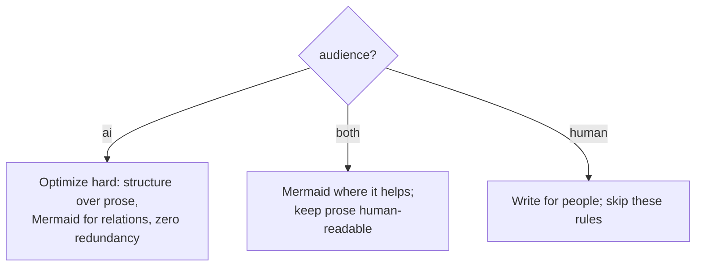
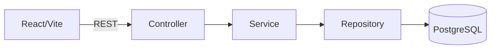

# Doc authoring for token efficiency

Loaded by `SKILL.md` when you write or edit documentation. The core idea: **how hard you
optimize depends on who reads the doc.** Aggressive density is free when only agents read
it, and harmful when humans do.

## 1. Determine audience

Order of precedence:

1. Explicit frontmatter `audience:` field (`ai` | `both` | `human`).
2. Filename / convention defaults when no frontmatter:
    - `ai` by default: `CLAUDE.md`, `AGENTS.md`, `.cursor/rules/*`, `*.rules.md`, anything
      under an `agents/`-style instructions dir.
    - `both` by default: `README.md`, `docs/**` — written for people but often read by agents.
    - `human` by default: changelogs, marketing, onboarding prose, anything clearly for people.
3. If still unsure, look at **content signals**:

| Signal                                              | Suggests |
| --------------------------------------------------- | -------- |
| Imperative rules, no narrative, technical shorthand | `ai`     |
| Mermaid diagrams, structured tables, zero prose     | `ai`     |
| Conversational tone, numbered steps, "you should"   | `human`  |
| Inline screenshots or GIF walkthroughs              | `human`  |
| Mix of rules and explanation                        | `both`   |

4. After all signals, still unsure → treat as `both` (the safe middle — never strip
   readability you can't recover).

When you create a new agent-facing doc, add the tag so the next agent doesn't have to guess:

```markdown
---
audience: ai
---
```

## 2. Optimization by audience



|         | structure-first | Mermaid for relations | trim prose/redundancy | keep human readability |
| ------- | :-------------: | :-------------------: | :-------------------: | :--------------------: |
| `ai`    |       yes       |          yes          |          yes          |      not required      |
| `both`  |       yes       |    where it helps     |        lightly        |        required        |
| `human` |    optional     |       optional        |          no           |        required        |

## 3. Mermaid beats prose for relationships

A paragraph describing how things connect costs more tokens and reads worse (for an agent)
than the equivalent diagram. Reach for Mermaid whenever the content is fundamentally about
**relationships, flow, hierarchy, sequence, or state** — not for plain definitions or prose.

| Content type                    | Mermaid diagram type |
| ------------------------------- | -------------------- |
| Architecture / dependencies     | `flowchart`          |
| Request / call sequence         | `sequenceDiagram`    |
| Lifecycle / status transitions  | `stateDiagram-v2`    |
| Data model / entities           | `erDiagram`          |
| Phases over time                | `gantt`              |
| Decision tree / branching logic | `flowchart TD`       |

## 4. Structure-first formatting (for `ai` and `both`)

- Lead with the answer; put detail below. Tables and lists over paragraphs for parallel facts.
- One fact per line where it aids scanning; link out instead of repeating content.
- Use progressive disclosure: a short top doc that points to detail files, not one giant file.

### Progressive disclosure for CLAUDE.md / AGENTS.md

A monolithic root config file pays full context cost every session. Split into a lean root
that references detail files; unreferenced files never load:

```
CLAUDE.md / AGENTS.md           ← root: ~20–30 lines max
  architecture.md               ← detail: only loads if root references it
  working-agreement.md          ← detail: only loads if root references it
```

Runtime-specific inclusion syntax (e.g. Claude Code uses `@./path/file.md`; other runtimes
have their own mechanisms). The principle is harness-agnostic. Each detail file carries its
own `audience: ai` tag. Root file: always `ai` if it's a CLAUDE.md or AGENTS.md.

## 5. Emoji as compact markers (ai / both docs)

Agents parse emoji reliably, so a _small, fixed_ set of status/category emoji can replace a
recurring word in tables and checklists:

| marker   | meaning            |
| -------- | ------------------ |
| ✅       | done / pass / yes  |
| ❌       | fail / no          |
| ⚠️       | caution / caveat   |
| 🔴 🟡 🟢 | severity or health |
| ➡️       | leads to / then    |

Use them only where they replace a repeated status word (a status column, a checklist item)
— not as decoration.

**Emoji are not a general token-saver.** Many emoji are 2–3+ tokens (variation selectors,
skin-tone modifiers, ZWJ sequences). You also lose grep-ability. The win is fewer words and
diagrams, not symbol substitution. Stick to single-codepoint markers from a known vocabulary.

## 6. What is NOT optimization

These cost clarity for trivial token savings — don't do them:

- Stripping commas, quotes, or braces from prose/JSON. The win comes from _fewer words_, not
  denser syntax.
- Sprinkling emoji into prose to "save tokens" — see §5; use only as fixed status markers.
- Removing section separators purely to save bytes.
- Inventing a private shorthand the next agent has to decode. Clear standard Markdown wins.

## 7. Before/after: bloated → lean (`audience: ai`)

### Before — 18 lines of prose, high redundancy

```markdown
## Architecture

The application uses a layered architecture. The backend is a Spring Boot REST API that is
backed by a PostgreSQL database. The frontend is a React single-page application that was
built using Vite. The backend exposes REST endpoints and the frontend calls those endpoints
over HTTP using fetch.

When developing features, the developer should always check the existing service layer before
adding new code. The repository layer is responsible for database queries. The service layer
contains business logic. The controller layer handles HTTP requests.

Remember: controllers don't call repositories directly, they go through the service layer.
This is important to maintain separation of concerns.
```

### After — 5 lines with a diagram, same information

````md
## Architecture



- Controllers → services only (never directly to repositories)
````

**Saved: 13 lines, ~130 tokens. The diagram encodes the constraint visually.**

## 8. Anti-patterns catalog

| Anti-pattern                         | Symptom                                            | Fix                                                         |
| ------------------------------------ | -------------------------------------------------- | ----------------------------------------------------------- |
| **Mirrored README**                  | CLAUDE.md repeats what README already covers       | Replace with `@./README.md` reference or a one-line summary |
| **Stale task lists**                 | Bullet points of completed or abandoned tasks      | Delete; task state belongs in issues/PRs                    |
| **Prose architecture**               | Multi-paragraph "how the system works" description | Replace with a Mermaid flowchart (§3)                       |
| **Dead imports**                     | `@./path` target was renamed or deleted            | Fix or remove the import                                    |
| **Chatty working agreement**         | Rules written as full sentences with rationale     | Rewrite as one imperative per line                          |
| **Repeated constraints**             | Same rule stated in multiple sections              | Merge to one canonical location; link from others           |
| **Human onboarding in agent config** | "Welcome to the project. To get started…"          | Move to README; CLAUDE.md / AGENTS.md is not a welcome doc  |
| **Version-pinned prose**             | "We are using React 18" (will rot)                 | Use `@./package.json` or link to the authoritative source   |

## 9. Skill description quality (for authors of agent-facing skill configs)

The `description` field in a skill's frontmatter is the primary trigger signal. A poor
description causes mis-triggers (too broad) or no triggers (too narrow).

**Structure for trigger accuracy:**

1. **What the skill does** — one short sentence.
2. **When to invoke** — specific scenarios, trigger phrases, or file types.
3. **When NOT to invoke** — explicit negative examples prevent collisions.
4. **Keyword anchor** (optional) — a unique term that always triggers:
   _"Keyword X always triggers this skill."_

| Problem                | Symptom                             | Fix                                                         |
| ---------------------- | ----------------------------------- | ----------------------------------------------------------- |
| Too broad              | Fires on unrelated tasks            | Add explicit `Not for …` clause                             |
| Too narrow             | Never fires                         | Add more trigger phrases / scenarios                        |
| Competing triggers     | Two skills fight for the same input | Add `not for` in each to differentiate                      |
| Missing negative guard | Fires on human-facing docs          | Add: `Not for README edits, changelogs, human-facing prose` |

Aim for ~60 words in descriptions — every word costs startup tokens on every session.
Complex multi-trigger skills may need more; that is a known trade-off, not a mistake.

---

See also: [`search-and-read.md`](search-and-read.md) — efficient reading patterns.
