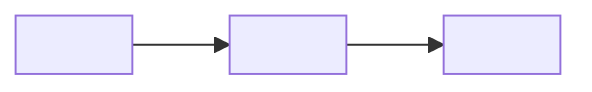

# <Project Name> - Architecture Reference

> Current and proposed technical structure of the system.
> Keep product scope in the Roadmap, UI/UX in the Design reference, and decision history in ADRs.

| Document owner | Last reviewed | Verified against |
| --- | --- | --- |
| `<owner>` | `<YYYY-MM-DD>` | `<commit, release, environment, or not yet implemented>` |

## Template Setup

Complete this section with the developer before using the file as project guidance, then
delete the entire section.

### Source-first setup

1. Ask the developer to share existing architecture inputs before asking detailed questions:
   code repositories, package manifests, diagrams, schemas, API specifications, deployment
   files, infrastructure configuration, provider constraints, and prior technical notes.
2. Inspect the available sources and prefill what they establish. Never request secrets or
   copy credentials into documentation.
3. Separate verified current state from intended or proposed architecture.
4. Identify conflicts, missing boundaries, operational risks, and assumptions.
5. Ask one grouped set of questions only for the remaining gaps. Do not make the developer
   repeat information already available in a source.
6. Use the simplest architecture that satisfies known requirements. Do not introduce
   services, queues, caches, abstractions, or infrastructure without a concrete need.

If the project is still only an idea, document a small proposed baseline and mark it
`Proposed`. Promote it to `Active` only after implementation is verified.

### Setup choices

| Item | Project value |
| --- | --- |
| Architecture maturity | `<proposed / partially implemented / established>` |
| Initial topology | `<single app / frontend + API / monorepo / other>` |
| Deployment target | `<platforms or undecided>` |
| Default contract workflow | `<spec-first / schema-generated / implementation-first; exceptions recorded per interface>` |
| Data sensitivity | `<public / internal / personal / regulated>` |
| Availability / scale expectations | `<known expectations or ordinary MVP baseline>` |
| Roadmap | `<ROADMAP_PATH>` |
| Design reference | `<DESIGN_PATH>` |
| API reference | `<API_DOCS_PATH>` |
| ADR registry | `<ADR_PATH>` |

Remove all setup instructions, unresolved placeholders, examples, and rows that do not
apply. Move relevant unresolved choices to the Roadmap Decision Log. Do not preserve empty
sections merely because they exist in the template.

## 1. Architecture Contract & Sources

<!-- State what this document owns and where adjacent concerns live. -->

- **This document owns:** current/proposed system structure, boundaries, data ownership,
  runtime flows, infrastructure, and operational contracts.
- **Roadmap owns:** product scope, delivery phases, priorities, and deferred work.
- **Design reference owns:** UI/UX direction, screens, components, and design status.
- **API/schema references own:** intended exact request, event, and data contracts.
- **ADRs own:** rationale and consequences of significant architectural decisions.
- **Code and deployed configuration own:** the latest verifiable implementation state.

When documentation and implementation disagree about current behavior, verify the code and
runtime, then update this document. Observed runtime proves only the checked release and
environment; reconcile it with code/configuration before generalizing. The selected
per-interface contract workflow determines which source leads a change when an interface
specification and implementation disagree. When proposed sources conflict, ask the developer
to choose; record a significant resolution in an ADR.

### Architecture sources

| Source | Location / access | Authoritative for | Limitations / notes |
| --- | --- | --- | --- |
| Repository / code | `<path or URL>` | `<implemented structure and behavior>` | `<branches, packages, or unverified areas>` |
| Architecture diagrams | `<path or URL>` | `<system context or flows>` | `<revision or coverage>` |
| Data schema | `<path or URL>` | `<entities, relations, constraints>` | `<migration or environment caveats>` |
| API / event specification | `<path or URL>` | `<interfaces and payloads>` | `<version or incomplete areas>` |
| Infrastructure / deployment config | `<path or URL>` | `<runtime topology and environments>` | `<provider-managed or missing pieces>` |
| Written constraints / prior notes | `<path, URL, or summary>` | `<intent and non-code constraints>` | `<open interpretation>` |

### State legend

| State | Meaning |
| --- | --- |
| `Proposed` | Intended direction that is not yet verified in the implementation. |
| `Partial` | Some is implemented; write `Partial - missing: <specific gap>` in the state cell. |
| `Active` | Present and verified against the revision/environment named above. |
| `Deprecated` | Still present but scheduled for removal or replacement. |

## 2. System Overview

### Purpose and constraints

- **System purpose:** <What the system does in one or two sentences.>
- **Primary users / actors:** <People, administrators, external systems, scheduled jobs.>
- **Key constraints:** <Compliance, budget, latency, hosting, team, deadline, or platform.>
- **Architecture non-goals:** <Complexity or capabilities deliberately excluded.>

### Context diagram

Show the system, its actors, and external systems. Keep internals for the next section.



### Architecture summary

| Concern | Current / proposed choice | State | Rationale / source |
| --- | --- | --- | --- |
| Application style | `<modular monolith / client-server / serverless / other>` | `<state>` | `<brief reason or ADR>` |
| Frontend | `<runtime and rendering approach>` | `<state>` | `<source>` |
| Backend | `<runtime and API approach>` | `<state>` | `<source>` |
| Primary data store | `<choice>` | `<state>` | `<source or ADR>` |
| Async / real-time work | `<none or approach>` | `<state>` | `<source or ADR>` |
| Deployment | `<topology and provider>` | `<state>` | `<source or ADR>` |

## 3. Building Blocks & Boundaries

### Repository and deployables

```text
<repository>/
  <app-or-package>/    # <responsibility>
  <app-or-package>/    # <responsibility>
  <docs>/              # <responsibility>
```

| Deployable / package | Responsibility | Owns | Depends on | State |
| --- | --- | --- | --- | --- |
| `<name>` | `<single responsibility>` | `<data, routes, jobs, or UI>` | `<dependencies>` | `<state>` |

### Internal modules

Document only meaningful boundaries. File-level inventories belong in code navigation or
package documentation.

| Module / area | Responsibility | Public interface | Data ownership | State |
| --- | --- | --- | --- | --- |
| `<name>` | `<what it owns>` | `<API, events, functions, routes>` | `<owned data or none>` | `<state>` |

### Primary execution paths

Capture only flows that cross boundaries or have non-obvious failure behavior.

```text
<request/event> -> <entry point> -> <domain logic> -> <data/integration> -> <response/result>
```

## 4. Data & Interfaces

### Data stores and ownership

| Store | Purpose | Owner | Source of truth for | Lifecycle / backup | State |
| --- | --- | --- | --- | --- | --- |
| `<database, object store, cache, search, etc.>` | `<purpose>` | `<module/service>` | `<data>` | `<retention, backup, expiry>` | `<state>` |

Link the canonical schema or data-model document: `<DATA_MODEL_PATH>`.

Document here only the entities and state transitions needed to understand system behavior:

| Entity / state machine | Owner | Key invariant or lifecycle | Canonical source |
| --- | --- | --- | --- |
| `<entity or process>` | `<module/service>` | `<invariant or states>` | `<schema or diagram>` |

### Interfaces

Contract workflows:

- `spec-first`: approve the contract before implementation, then implement against it.
- `schema-generated`: change the canonical schema, then regenerate dependent artifacts.
- `implementation-first`: change verified implementation and synchronize its contract in the
  same logical change.

| Interface | Direction | Protocol | Contract source / workflow | Auth / trust boundary | Failure behavior | State |
| --- | --- | --- | --- | --- | --- | --- |
| `<HTTP API, event, webhook, job, file exchange>` | `<caller -> owner>` | `<protocol>` | `<source; workflow or default>` | `<identity or verification>` | `<retry, reject, degrade>` | `<state>` |

### External integrations

| Integration | Purpose | Data exchanged | Failure / rate-limit strategy | Config owner | State |
| --- | --- | --- | --- | --- | --- |
| `<provider or system>` | `<purpose>` | `<data classification>` | `<timeout, retry, fallback, alert>` | `<env/config reference>` | `<state>` |

## 5. Cross-Cutting Contracts

Keep this as a compact index of guarantees and canonical references. Add detail only when a
contract spans multiple modules and cannot be understood from a linked document.

| Concern | System contract | Canonical source | State |
| --- | --- | --- | --- |
| Authentication | `<identity and session model>` | `<auth doc or code>` | `<state>` |
| Authorization | `<roles, ownership, deny/default policy>` | `<security doc or code>` | `<state>` |
| Validation and errors | `<boundary validation and error shape>` | `<API/rule source>` | `<state>` |
| Security | `<trust boundaries, secrets, abuse protection>` | `<security doc/checklist>` | `<state>` |
| Privacy and retention | `<personal data, deletion, retention>` | `<privacy/data doc>` | `<state>` |
| Observability | `<logs, metrics, traces, alerts>` | `<monitoring guide>` | `<state>` |
| Reliability | `<timeouts, retries, idempotency, recovery>` | `<runbook or rule>` | `<state>` |
| Performance and scaling | `<budgets, bottlenecks, scaling trigger>` | `<evidence or plan>` | `<state>` |
| Caching | `<ownership, invalidation, consistency>` | `<rule or implementation>` | `<state>` |

Remove rows that do not materially apply. Never treat a client-side guard or hidden UI as a
security boundary when the server owns authorization.

### Minimum web security baseline

- Identify every external trust boundary; validate untrusted input and contextually
  encode or sanitize user-controlled output at render boundaries.
- Classify sensitive data and document where it is stored, transmitted, logged, and deleted.
- Enforce authorization at the server/data boundary, independent of client UI controls.
- Require protected transport outside local development; define secure session/token storage
  and request-forgery protection appropriate to the authentication mechanism.
- Keep secrets out of code, logs, client bundles, and documentation.

## 6. Runtime & Delivery

### Environments

| Environment | Purpose | Runtime topology | Data / dependencies | Access boundary |
| --- | --- | --- | --- | --- |
| `<local / test / staging / production>` | `<purpose>` | `<processes and services>` | `<real, seeded, mocked>` | `<who or what can access>` |

### Configuration and secrets

- Canonical variable inventory: `<ENV_DOC_PATH>`
- Example configuration: `<ENV_EXAMPLE_PATH>`
- Secret storage: `<secret manager or platform mechanism>`
- Configuration validation: `<startup/runtime strategy>`

Do not list secret values here.

### Delivery and operations

| Concern | Contract / approach | Canonical source | State |
| --- | --- | --- | --- |
| Local development | `<how dependencies and apps run>` | `<getting-started guide>` | `<state>` |
| CI quality gates | `<build, test, lint, type, security checks>` | `<workflow or guide>` | `<state>` |
| Deployment | `<artifact and release process>` | `<deployment guide/config>` | `<state>` |
| Database migrations | `<ordering, compatibility, ownership>` | `<migration guide>` | `<state>` |
| Rollback | `<application and data rollback constraints>` | `<runbook>` | `<state>` |
| Backup and restore | `<scope, frequency, restore verification>` | `<backup guide>` | `<state>` |
| Scheduled / background work | `<scheduler, workers, concurrency>` | `<implementation or guide>` | `<state>` |

## 7. Architecture Decisions

Use ADRs for significant, durable choices with meaningful alternatives or consequences. Do
not create ADRs for routine implementation details.

| ID | Decision | Status | ADR | Revisit trigger |
| --- | --- | --- | --- | --- |
| `ADR-001` | `<decision>` | `<Proposed / Accepted / Rejected / Superseded>` | `<path>` | `<condition that would reopen it>` |

An ADR may be `Proposed` while a concrete decision is under review; it becomes current
direction only when `Accepted`. Unresolved or deferred work without an active proposal belongs
in `<ROADMAP_PATH>#decision-log`. This section does not become a second backlog.

## 8. Verification & Maintenance

| Check | Evidence | Status |
| --- | --- | --- |
| Repository/deployable map matches code | `<paths or review date>` | `<status>` |
| Runtime/deployment topology matches configuration | `<config or environment check>` | `<status>` |
| Data ownership and schemas match migrations | `<schema/migration check>` | `<status>` |
| Interfaces match API/event contracts | `<spec or contract tests>` | `<status>` |
| Auth and trust boundaries are enforced server-side | `<tests or security review>` | `<status>` |
| Failure and recovery paths are exercised | `<tests, drill, or runbook evidence>` | `<status>` |
| Operational docs and environment inventory resolve | `<link/path check>` | `<status>` |

Update this document when a system boundary, deployable, data owner, interface, integration,
environment, or operational guarantee changes. Split deep detail into focused architecture
documents when this overview stops being easy to scan, and link them from the relevant row.
